# Design Document: Placetrix System Architecture

## Overview

Placetrix is a comprehensive placement and recruitment management platform built with Next.js 14+, Supabase (PostgreSQL), and TypeScript. The system serves three primary user roles: **Candidates** (students seeking placements), **Recruiters** (companies hiring talent), and **Institutes** (educational institutions managing assessments). The platform integrates multiple subsystems including job management, application tracking, resume generation/analysis, coding assessments (LogicLab), test management, analytics, and real-time notifications.

The architecture follows a modern serverless approach with Next.js App Router for server-side rendering, Server Components for data fetching, Server Actions for mutations, and Supabase for backend services (authentication, database, storage, real-time subscriptions). The system is designed for deployment on Vercel with edge-optimized middleware for authentication and session management.

## System Architecture

### High-Level Architecture Diagram

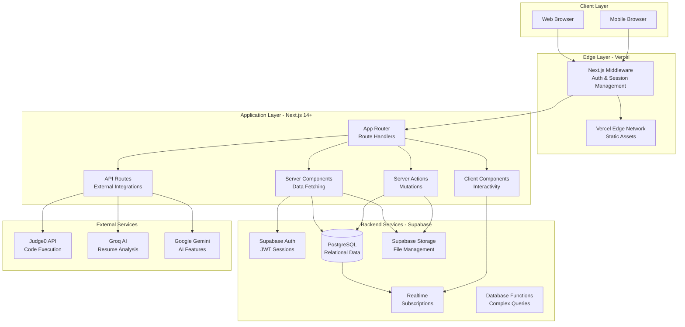

### Deployment Architecture

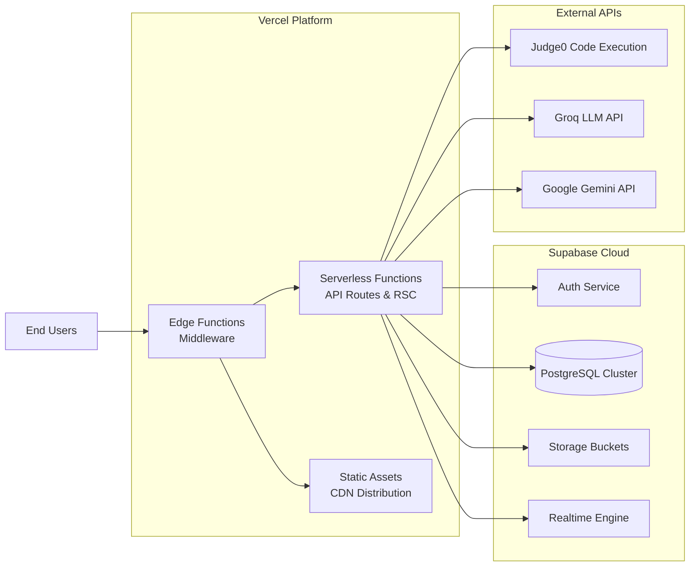

## Core Components and Interfaces

### 1. Authentication & Authorization System

#### Component: Authentication Flow

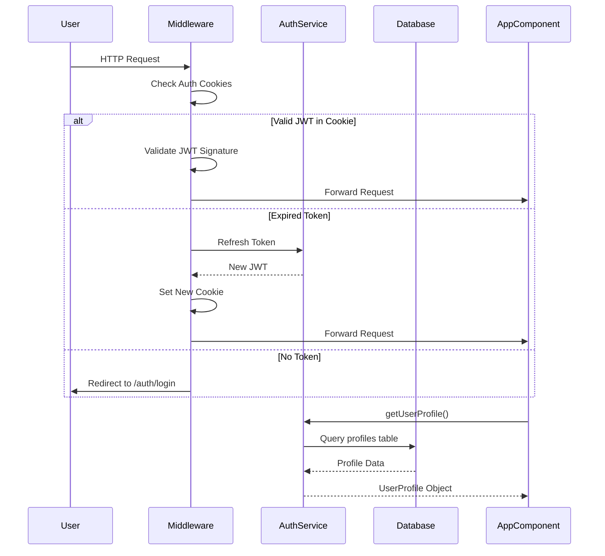

#### Interface: UserProfile

```typescript
interface UserProfile {
  id: string                    // UUID from Supabase Auth
  display_name: string          // User's full name
  email: string                 // Primary email
  avatar_path: string | null    // Storage path to avatar image
  username: string | null       // Unique username
  account_type: AccountType     // Role-based access control
}

type AccountType = "candidate" | "institute" | "admin" | "recruiter"
```

#### Interface: Authentication Service

```typescript
interface AuthenticationService {
  // Session Management
  getUserProfile(): Promise<UserProfile | null>
  signOut(scope: "local" | "global"): Promise<void>
  refreshSession(): Promise<Session | null>
  
  // Profile Resolution
  profileFromClaims(claims: JWTClaims): UserProfile | null
  profileFromAuthUser(user: AuthUser): UserProfile
  
  // Session Validation
  isDefinitiveRevocation(error: AuthApiError): boolean
  validateSessionCookie(cookie: string): Promise<boolean>
}
```

### 2. Dashboard & Home Module

#### Component: Dashboard Layout

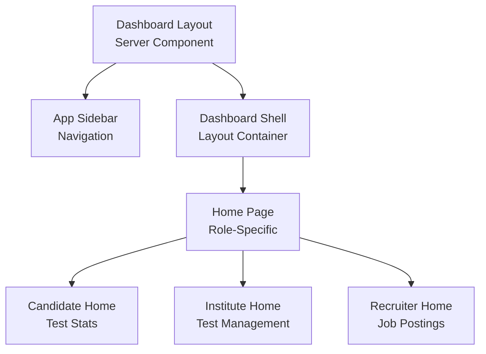

#### Interface: Home Statistics

```typescript
interface CandidateHomeStats {
  profile: CandidateProfile
  stats: {
    total_tests: number
    live_tests: number
    upcoming_tests: number
    completed_tests: number
  }
}

interface InstituteHomeStats {
  profile: InstituteProfile
  stats: {
    total_tests: number
    live_tests: number
    upcoming_tests: number
    past_tests: number
    draft_tests: number
    total_attempts: number
  }
}
```

### 3. Jobs & Applications Management

#### Component: Job Posting Workflow

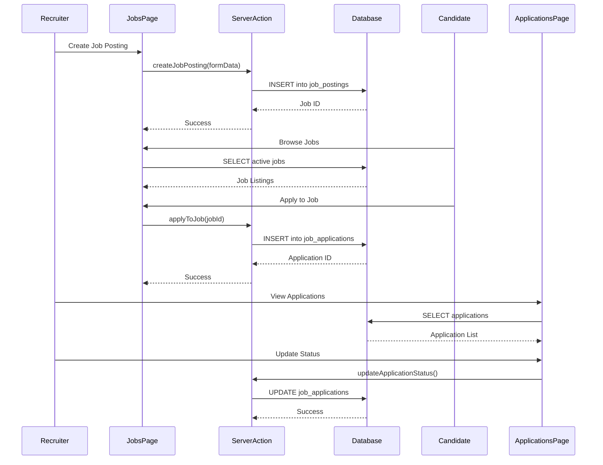

#### Interface: Job Posting

```typescript
interface JobPosting {
  id: string
  recruiter_id: string
  title: string
  description: string
  requirements: string
  job_type: "full-time" | "part-time" | "contract" | "internship"
  work_mode: "remote" | "hybrid" | "onsite"
  location: string
  salary_min: number | null
  salary_max: number | null
  salary_currency: string
  skills: string[]
  application_deadline: string | null
  status: "draft" | "active" | "closed"
  created_at: string
  updated_at: string
}

interface JobApplication {
  id: string
  job_id: string
  candidate_id: string
  status: "pending" | "reviewed" | "shortlisted" | "rejected" | "accepted"
  resume_path: string | null
  cover_letter: string | null
  created_at: string
  updated_at: string
}
```

### 4. Resume Generator & Analyzer

#### Component: Resume Generation Flow

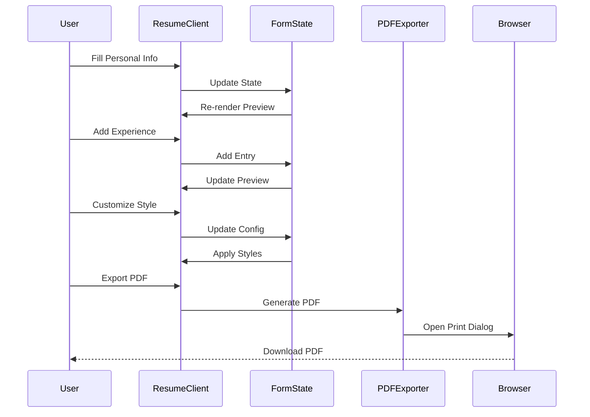

#### Component: Resume Analysis Flow

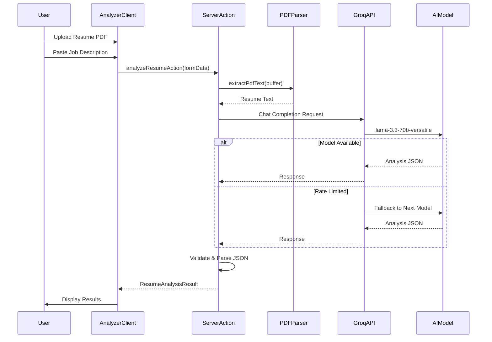

#### Interface: Resume Analysis

```typescript
interface ResumeAnalysisResult {
  atsScore: number                          // 0-100 ATS compatibility score
  matchSummary: string                      // 2-3 sentence summary
  keywordAnalysis: {
    matched: string[]                       // Keywords found in resume
    missing: string[]                       // Keywords missing from resume
  }
  skillGap: {
    technical: string[]                     // Missing technical skills
    tools: string[]                         // Missing tools/platforms
    soft: string[]                          // Missing soft skills
  }
  sectionFeedback: {
    structure: string                       // Resume structure feedback
    projects: string                        // Projects section feedback
    experience: string                      // Experience section feedback
    skills: string                          // Skills section feedback
  }
  improvements: string[]                    // Actionable suggestions
  improvedBullets: string[]                 // Rewritten bullet points
  finalVerdict: {
    shortlist: boolean                      // Recommendation
    reason: string                          // Justification
  }
}
```

### 5. LogicLab - Coding Assessment Platform

#### Component: LogicLab Architecture

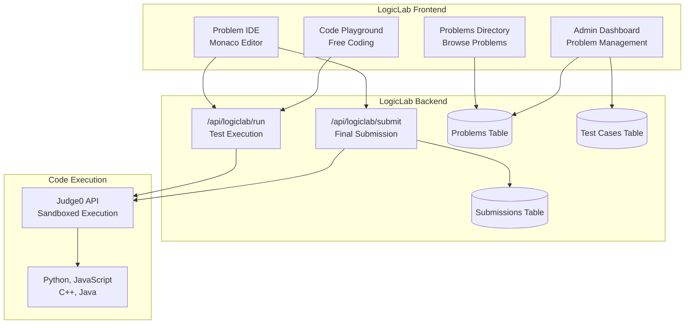

#### Component: Code Execution Flow

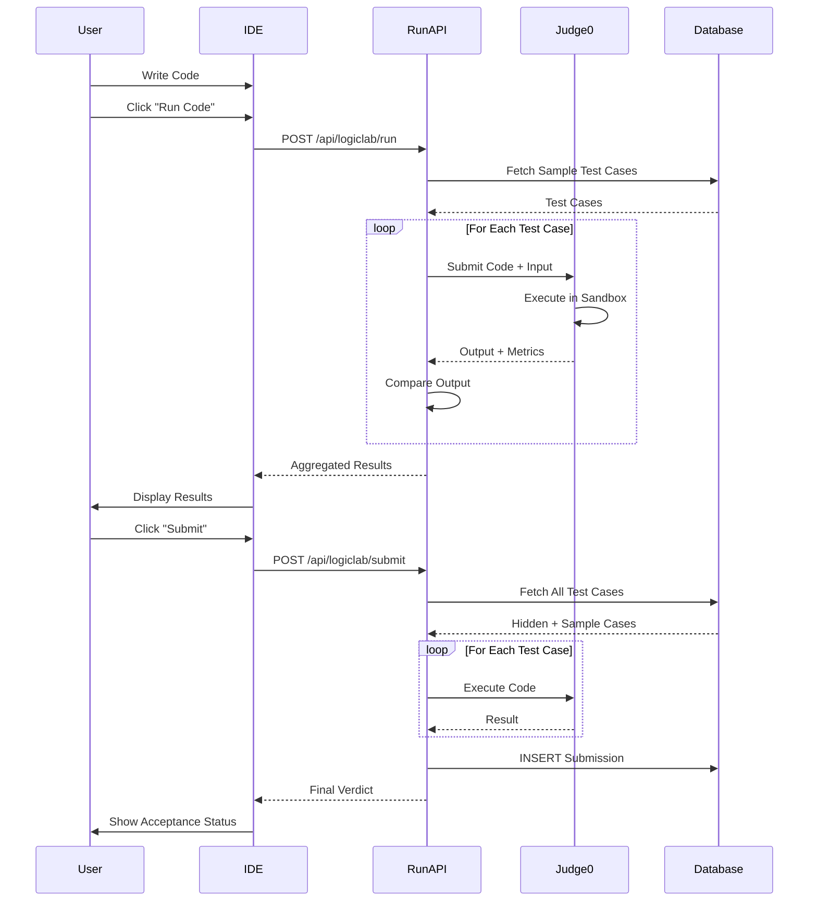

#### Interface: Coding Problem

```typescript
interface CodingProblem {
  id: string
  title: string
  description: string                       // Markdown with examples
  difficulty: "Easy" | "Medium" | "Hard"
  tags: string[]                            // ["Array", "Dynamic Programming"]
  time_limit: number                        // Seconds
  memory_limit: number                      // MB
  boilerplates: Record<string, string>      // Language ID -> starter code
  driver_codes: Record<string, string>      // Language ID -> test harness
  created_at: string
  updated_at: string
}

interface TestCase {
  id: string
  problem_id: string
  input: string                             // Newline-separated parameters
  expected_output: string
  is_sample: boolean                        // Visible to users
  order_index: number
}

interface CodingSubmission {
  id: string
  problem_id: string
  user_id: string
  code: string
  language_id: number                       // Judge0 language ID
  status: "Accepted" | "Wrong Answer" | "Time Limit Exceeded" | "Runtime Error" | "Compilation Error"
  runtime: number | null                    // Seconds
  memory: number | null                     // MB
  passed_count: number
  total_count: number
  created_at: string
}
```

### 6. Test Management System

#### Component: Test Lifecycle

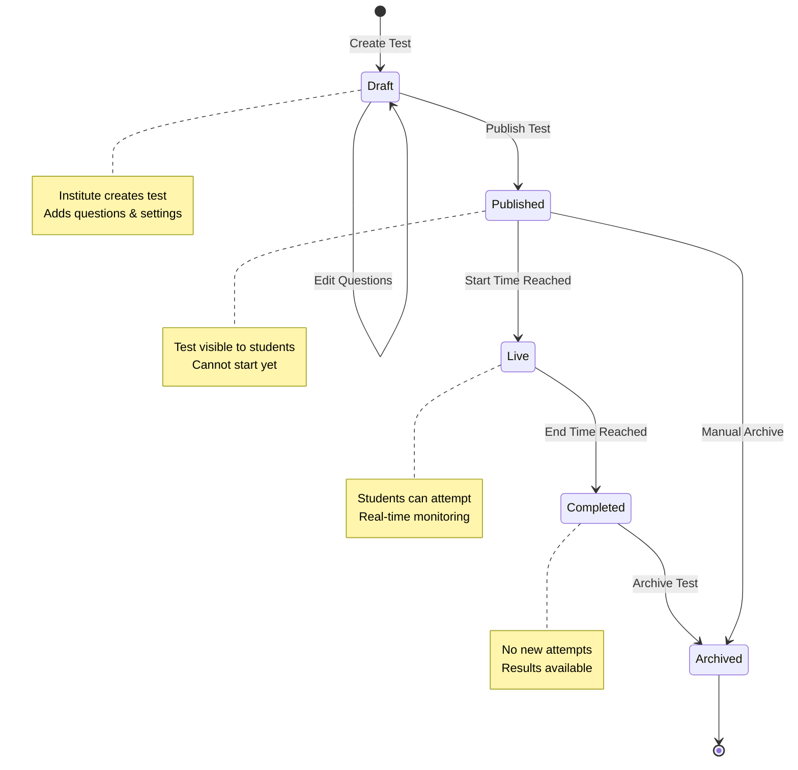

#### Component: Test Attempt Flow

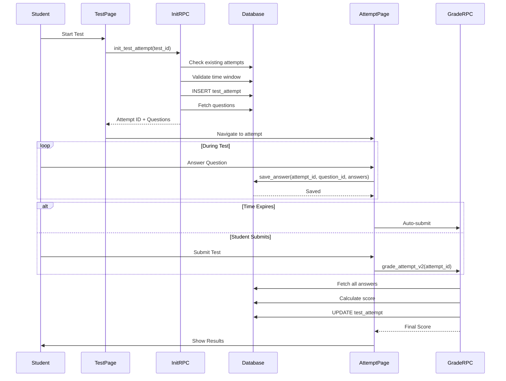

#### Interface: Test & Attempt

```typescript
interface Test {
  id: string
  institute_id: string
  title: string
  description: string | null
  instructions: string | null
  time_limit_seconds: number | null
  max_attempts: number
  pass_percentage: number | null
  shuffle_questions: boolean
  shuffle_options: boolean
  strict_mode: boolean                      // Prevent tab switching
  results_available: boolean
  status: "draft" | "published" | "archived"
  available_from: string | null
  available_until: string | null
  created_at: string
  updated_at: string
}

interface TestAttempt {
  id: string
  test_id: string
  student_id: string
  attempt_number: number
  status: "in_progress" | "submitted" | "abandoned" | "auto_submitted"
  started_at: string
  submitted_at: string | null
  expires_at: string | null
  time_spent_seconds: number | null
  score: number | null
  total_marks: number | null
  percentage: number | null
  passed: boolean | null
  tab_switch_count: number
  ip_address: string
  user_agent: string | null
  created_at: string
  updated_at: string
}

interface Question {
  id: string
  test_id: string
  question_text: string
  question_type: "single_correct" | "multiple_correct" | "true_false"
  marks: number
  negative_marks: number
  explanation: string | null
  media_url: string | null
  order_index: number
  created_at: string
  updated_at: string
}

interface Option {
  id: string
  question_id: string
  option_text: string
  is_correct: boolean
  media_url: string | null
  order_index: number
}

interface AttemptAnswer {
  id: string
  attempt_id: string
  question_id: string
  selected_option_ids: string[]
  is_correct: boolean | null
  marks_awarded: number | null
  time_spent_seconds: number
  answered_at: string
  updated_at: string
}
```

## Data Models

### Entity-Relationship Diagram

```mermaid
erDiagram
    profiles ||--o{ candidate_profiles : has
    profiles ||--o{ institute_profiles : has
    profiles ||--o{ recruiter_profiles : has
    profiles ||--o{ user_sessions : has
    profiles ||--o{ test_attempts : creates
    profiles ||--o{ job_applications : submits
    
    institute_profiles ||--o{ tests : creates
    tests ||--o{ questions : contains
    questions ||--o{ options : has
    questions ||--o{ question_tags : tagged_with
    tags ||--o{ question_tags : used_in
    
    tests ||--o{ test_attempts : attempted_by
    test_attempts ||--o{ attempt_answers : contains
    test_attempts ||--o{ test_attempt_feedback : receives
    
    questions ||--o{ attempt_answers : answered_in
    options ||--o{ attempt_answers : selected_in
    
    recruiter_profiles ||--o{ job_postings : creates
    job_postings ||--o{ job_applications : receives
    candidate_profiles ||--o{ job_applications : submits
    
    profiles {
        uuid id PK
        string email UK
        string username UK
        string display_name
        string avatar_path
        string account_type
        string account_subtype
        boolean is_active
        timestamp created_at
        timestamp updated_at
    }

    
    candidate_profiles {
        uuid profile_id PK,FK
        string first_name
        string middle_name
        string last_name
        string full_name
        date date_of_birth
        string gender
        string phone_number
        string current_address
        string permanent_address
        string aadhaar_number
        string university_prn
        uuid institute_id FK
        boolean institute_verified
        string course_name
        number passout_year
        number cgpa
        number sgpa_sem1_to_10
        boolean is_hsc
        number hsc_percentage
        number hsc_pass_year
        boolean is_diploma
        number diploma_percentage
        number diploma_pass_year
        number ssc_percentage
        number ssc_pass_year
        string[] skills
        string github_url
        string linkedin_url
        string[] portfolio_links
        string profile_image_path
        boolean profile_complete
        boolean profile_updated
        timestamp created_at
        timestamp updated_at
    }
    
    institute_profiles {
        uuid profile_id PK,FK
        string institute_name
        string institute_code
        string email
        string phone_number
        string website_url
        string address
        string city
        string state
        string country
        string pincode
        number established_year
        string affiliation
        string[] courses
        string principal_name
        string principal_email
        string principal_phone
        string[] social_links
        string logo_path
        boolean profile_complete
        boolean profile_updated
        timestamp created_at
        timestamp updated_at
    }
    
    recruiter_profiles {
        uuid profile_id PK,FK
        string company_name
        string company_description
        string industry
        string company_size
        string company_website
        string headquarters_city
        string headquarters_state
        string headquarters_country
        string department
        string designation
        string phone_number
        string linkedin_url
        string company_logo_path
        boolean profile_complete
        boolean profile_updated
        timestamp created_at
        timestamp updated_at
    }

    
    tests {
        uuid id PK
        uuid institute_id FK
        string title
        text description
        text instructions
        number time_limit_seconds
        number max_attempts
        number pass_percentage
        boolean shuffle_questions
        boolean shuffle_options
        boolean strict_mode
        boolean results_available
        string status
        timestamp available_from
        timestamp available_until
        timestamp created_at
        timestamp updated_at
    }
    
    questions {
        uuid id PK
        uuid test_id FK
        text question_text
        string question_type
        number marks
        number negative_marks
        text explanation
        string media_url
        number order_index
        timestamp created_at
        timestamp updated_at
    }
    
    options {
        uuid id PK
        uuid question_id FK
        text option_text
        boolean is_correct
        string media_url
        number order_index
    }
    
    test_attempts {
        uuid id PK
        uuid test_id FK
        uuid student_id FK
        number attempt_number
        string status
        timestamp started_at
        timestamp submitted_at
        timestamp expires_at
        number time_spent_seconds
        number score
        number total_marks
        number percentage
        boolean passed
        number tab_switch_count
        inet ip_address
        string user_agent
        timestamp created_at
        timestamp updated_at
    }
    
    attempt_answers {
        uuid id PK
        uuid attempt_id FK
        uuid question_id FK
        uuid[] selected_option_ids
        boolean is_correct
        number marks_awarded
        number time_spent_seconds
        timestamp answered_at
        timestamp updated_at
    }

    
    job_postings {
        uuid id PK
        uuid recruiter_id FK
        string title
        text description
        text requirements
        string job_type
        string work_mode
        string location
        number salary_min
        number salary_max
        string salary_currency
        string[] skills
        timestamp application_deadline
        string status
        timestamp created_at
        timestamp updated_at
    }
    
    job_applications {
        uuid id PK
        uuid job_id FK
        uuid candidate_id FK
        string status
        string resume_path
        text cover_letter
        timestamp created_at
        timestamp updated_at
    }
    
    tags {
        uuid id PK
        string name UK
        timestamp created_at
    }
    
    question_tags {
        uuid question_id PK,FK
        uuid tag_id PK,FK
    }
    
    user_sessions {
        uuid id PK
        uuid user_id FK
        inet ip
        string user_agent
        string tag
        timestamp not_after
        timestamp created_at
        timestamp updated_at
    }
    
    test_attempt_feedback {
        uuid id PK
        uuid attempt_id FK
        uuid test_id FK
        uuid student_id FK
        number rating
        string difficulty_felt
        text overall_comment
        text suggestions
        text bugs_issues
        timestamp created_at
    }
```

### Database Views

```typescript
// Materialized view for test summaries
interface ViewTestSummary {
  id: string
  title: string
  description: string
  institute_id: string
  institute_name: string
  status: string
  available_from: string
  available_until: string
  time_limit_seconds: number
  results_available: boolean
  question_count: number
  total_marks: number
  total_attempts: number
  submitted_attempts: number
  avg_score_pct: number
}


// View for detailed attempt results
interface ViewTestResultsDetailed {
  attempt_id: string
  test_id: string
  student_id: string
  student_name: string
  student_email: string
  branch: string
  passout_year: number
  attempt_number: number
  status: string
  started_at: string
  submitted_at: string
  time_spent_seconds: number
  score: number
  total_marks: number
  percentage: number
  passed: boolean
  tab_switch_count: number
}

// View for question analysis
interface ViewQuestionAnalysis {
  question_id: string
  test_id: string
  question_text: string
  marks: number
  total_answers: number
  correct_answers: number
  success_rate_pct: number
  avg_time_spent: number
}

// View for tag performance
interface TagPerformance {
  student_id: string
  test_id: string
  tag_id: string
  tag_name: string
  total_questions: number
  correct_count: number
  accuracy_pct: number
}
```

## Algorithmic Pseudocode

### Algorithm: Session Validation and Refresh

```pascal
ALGORITHM validateAndRefreshSession(request)
INPUT: request containing auth cookies
OUTPUT: validated session or redirect


BEGIN
  // Step 1: Extract auth cookie from request
  authCookie ← extractCookie(request, "auth-token")
  
  IF authCookie = NULL THEN
    RETURN redirect("/auth/login")
  END IF
  
  // Step 2: Validate JWT signature locally
  claims ← validateJWTSignature(authCookie)
  
  IF claims = NULL THEN
    RETURN redirect("/auth/login")
  END IF
  
  // Step 3: Check token expiration
  currentTime ← getCurrentTimestamp()
  expiresAt ← claims.exp
  
  IF currentTime >= expiresAt THEN
    // Token expired, attempt refresh
    refreshToken ← extractCookie(request, "refresh-token")
    
    IF refreshToken = NULL THEN
      RETURN redirect("/auth/login")
    END IF
    
    // Call Supabase Auth to refresh
    TRY
      newSession ← supabaseAuth.refreshSession(refreshToken)
      
      IF newSession = NULL THEN
        RETURN redirect("/auth/login")
      END IF
      
      // Set new cookies
      setCookie(response, "auth-token", newSession.accessToken)
      setCookie(response, "refresh-token", newSession.refreshToken)
      setHeader(response, "x-supabase-refreshed", "true")
      
      RETURN proceed(request)
    CATCH error
      IF isDefinitiveRevocation(error) THEN
        clearAuthCookies(response)
        RETURN redirect("/auth/login?revoked=1")
      ELSE
        // Transient error, allow through with stale token
        RETURN proceed(request)
      END IF
    END TRY
  ELSE
    // Token still valid
    RETURN proceed(request)
  END IF
END
```

**Preconditions:**
- Request object contains cookie headers
- Supabase Auth service is accessible
- JWT secret key is configured

**Postconditions:**
- Valid session proceeds to application
- Expired sessions are refreshed or redirected
- Revoked sessions are cleared and redirected
- Response headers indicate refresh status

**Loop Invariants:** N/A (no loops)

### Algorithm: Test Attempt Initialization

```pascal
ALGORITHM initTestAttempt(testId, studentId)
INPUT: testId (UUID), studentId (UUID)
OUTPUT: attemptId and questions, or error


BEGIN
  // Step 1: Fetch test configuration
  test ← database.query("SELECT * FROM tests WHERE id = ?", testId)
  
  IF test = NULL THEN
    RETURN error("Test not found")
  END IF
  
  // Step 2: Validate test availability
  currentTime ← getCurrentTimestamp()
  
  IF test.available_from ≠ NULL AND currentTime < test.available_from THEN
    RETURN error("Test not yet available")
  END IF
  
  IF test.available_until ≠ NULL AND currentTime > test.available_until THEN
    RETURN error("Test has ended")
  END IF
  
  IF test.status ≠ "published" THEN
    RETURN error("Test is not published")
  END IF
  
  // Step 3: Check existing attempts
  existingAttempts ← database.query(
    "SELECT COUNT(*) FROM test_attempts WHERE test_id = ? AND student_id = ?",
    testId, studentId
  )
  
  IF existingAttempts >= test.max_attempts THEN
    RETURN error("Maximum attempts reached")
  END IF
  
  // Step 4: Check for in-progress attempt
  inProgressAttempt ← database.query(
    "SELECT id FROM test_attempts WHERE test_id = ? AND student_id = ? AND status = 'in_progress'",
    testId, studentId
  )
  
  IF inProgressAttempt ≠ NULL THEN
    // Resume existing attempt
    questions ← fetchQuestionsForAttempt(inProgressAttempt.id)
    RETURN { attemptId: inProgressAttempt.id, questions: questions }
  END IF
  
  // Step 5: Create new attempt
  attemptNumber ← existingAttempts + 1
  expiresAt ← NULL
  
  IF test.time_limit_seconds ≠ NULL THEN
    expiresAt ← currentTime + test.time_limit_seconds
  END IF
  
  attemptId ← generateUUID()
  
  database.execute(
    "INSERT INTO test_attempts (id, test_id, student_id, attempt_number, status, started_at, expires_at, ip_address, user_agent) VALUES (?, ?, ?, ?, 'in_progress', ?, ?, ?, ?)",
    attemptId, testId, studentId, attemptNumber, currentTime, expiresAt, request.ip, request.userAgent
  )
  
  // Step 6: Fetch and shuffle questions
  questions ← database.query(
    "SELECT * FROM questions WHERE test_id = ? ORDER BY order_index",
    testId
  )
  
  IF test.shuffle_questions = TRUE THEN
    questions ← shuffleArray(questions)
  END IF
  
  // Step 7: Fetch and shuffle options for each question
  FOR each question IN questions DO
    options ← database.query(
      "SELECT * FROM options WHERE question_id = ? ORDER BY order_index",
      question.id
    )
    
    IF test.shuffle_options = TRUE THEN
      options ← shuffleArray(options)
    END IF
    
    question.options ← options
  END FOR
  
  RETURN { attemptId: attemptId, questions: questions }
END
```

**Preconditions:**
- testId and studentId are valid UUIDs
- Database connection is established
- Test exists and is published
- Student has not exceeded max attempts

**Postconditions:**
- New attempt record created with status "in_progress"
- Questions and options fetched and shuffled if configured
- Attempt expiration time calculated based on time limit
- Returns attempt ID and question data

**Loop Invariants:**
- For question fetching loop: All previously processed questions have options attached
- Shuffle operations maintain array length

### Algorithm: Test Grading

```pascal
ALGORITHM gradeTestAttempt(attemptId, finalTimeSpent)
INPUT: attemptId (UUID), finalTimeSpent (number in seconds)
OUTPUT: graded attempt with score and percentage


BEGIN
  // Step 1: Fetch attempt and test details
  attempt ← database.query("SELECT * FROM test_attempts WHERE id = ?", attemptId)
  test ← database.query("SELECT * FROM tests WHERE id = ?", attempt.test_id)
  
  IF attempt = NULL OR test = NULL THEN
    RETURN error("Attempt or test not found")
  END IF
  
  // Step 2: Fetch all questions for the test
  questions ← database.query(
    "SELECT id, marks, negative_marks, question_type FROM questions WHERE test_id = ?",
    test.id
  )
  
  // Step 3: Fetch all answers for the attempt
  answers ← database.query(
    "SELECT question_id, selected_option_ids FROM attempt_answers WHERE attempt_id = ?",
    attemptId
  )
  
  // Create map for quick lookup
  answerMap ← createMap(answers, key: question_id)
  
  // Step 4: Calculate score
  totalScore ← 0
  totalMarks ← 0
  
  FOR each question IN questions DO
    totalMarks ← totalMarks + question.marks
    
    answer ← answerMap.get(question.id)
    
    IF answer = NULL THEN
      // Question not answered, skip
      CONTINUE
    END IF
    
    // Fetch correct options for this question
    correctOptions ← database.query(
      "SELECT id FROM options WHERE question_id = ? AND is_correct = TRUE",
      question.id
    )
    
    correctOptionIds ← extractIds(correctOptions)
    selectedOptionIds ← answer.selected_option_ids
    
    // Determine correctness based on question type
    isCorrect ← FALSE
    
    IF question.question_type = "single_correct" THEN
      // Must select exactly one correct option
      IF length(selectedOptionIds) = 1 AND selectedOptionIds[0] IN correctOptionIds THEN
        isCorrect ← TRUE
      END IF
    ELSE IF question.question_type = "multiple_correct" THEN
      // Must select all correct options and no incorrect ones
      IF setEquals(selectedOptionIds, correctOptionIds) THEN
        isCorrect ← TRUE
      END IF
    ELSE IF question.question_type = "true_false" THEN
      // Same as single_correct
      IF length(selectedOptionIds) = 1 AND selectedOptionIds[0] IN correctOptionIds THEN
        isCorrect ← TRUE
      END IF
    END IF
    
    // Award marks
    marksAwarded ← 0
    
    IF isCorrect = TRUE THEN
      marksAwarded ← question.marks
      totalScore ← totalScore + marksAwarded
    ELSE
      marksAwarded ← -question.negative_marks
      totalScore ← totalScore - question.negative_marks
    END IF
    
    // Update answer record
    database.execute(
      "UPDATE attempt_answers SET is_correct = ?, marks_awarded = ? WHERE attempt_id = ? AND question_id = ?",
      isCorrect, marksAwarded, attemptId, question.id
    )
  END FOR
  
  // Step 5: Calculate percentage and pass status
  percentage ← (totalScore / totalMarks) * 100
  passed ← FALSE
  
  IF test.pass_percentage ≠ NULL AND percentage >= test.pass_percentage THEN
    passed ← TRUE
  END IF
  
  // Step 6: Update attempt record
  database.execute(
    "UPDATE test_attempts SET status = 'submitted', submitted_at = ?, time_spent_seconds = ?, score = ?, total_marks = ?, percentage = ?, passed = ? WHERE id = ?",
    getCurrentTimestamp(), finalTimeSpent, totalScore, totalMarks, percentage, passed, attemptId
  )
  
  RETURN {
    score: totalScore,
    totalMarks: totalMarks,
    percentage: percentage,
    passed: passed
  }
END
```

**Preconditions:**
- attemptId is valid and exists in database
- All answers have been saved
- Questions have correct options marked
- finalTimeSpent is non-negative

**Postconditions:**
- All answers are marked as correct/incorrect
- Marks are awarded/deducted based on correctness
- Total score, percentage, and pass status calculated
- Attempt status updated to "submitted"
- Returns grading results

**Loop Invariants:**
- For question grading loop: totalScore and totalMarks accurately reflect all previously graded questions
- All processed answers have is_correct and marks_awarded fields updated

### Algorithm: Code Execution with Judge0

```pascal
ALGORITHM executeCode(sourceCode, languageId, problemId, testCases)
INPUT: sourceCode (string), languageId (number), problemId (UUID), testCases (array)
OUTPUT: execution results for all test cases


BEGIN
  // Step 1: Fetch problem configuration
  problem ← database.query("SELECT time_limit, memory_limit, driver_codes FROM coding_problems WHERE id = ?", problemId)
  
  IF problem = NULL THEN
    RETURN error("Problem not found")
  END IF
  
  // Step 2: Get driver code for language
  driverCode ← problem.driver_codes[languageId]
  
  IF driverCode = NULL THEN
    RETURN error("Language not supported for this problem")
  END IF
  
  // Step 3: Combine user code with driver code
  fullCode ← driverCode.replace("{{USER_CODE}}", sourceCode)
  
  // Step 4: Initialize results array
  results ← []
  
  // Step 5: Execute code for each test case
  FOR each testCase IN testCases DO
    // Prepare submission payload
    submission ← {
      source_code: base64Encode(fullCode),
      language_id: languageId,
      stdin: base64Encode(testCase.input),
      expected_output: base64Encode(testCase.expected_output),
      cpu_time_limit: problem.time_limit,
      memory_limit: problem.memory_limit * 1024  // Convert MB to KB
    }
    
    // Submit to Judge0
    TRY
      response ← httpPost("https://judge0-api.com/submissions?wait=true", submission)
      
      IF response.status_code ≠ 200 THEN
        results.append({
          testCase: testCase,
          status: "Error",
          error: "Judge0 API error"
        })
        CONTINUE
      END IF
      
      result ← parseJSON(response.body)
      
      // Check execution status
      IF result.status.id = 3 THEN
        // Accepted
        actualOutput ← base64Decode(result.stdout)
        expectedOutput ← testCase.expected_output
        
        // Compare outputs (trim whitespace)
        IF trim(actualOutput) = trim(expectedOutput) THEN
          results.append({
            testCase: testCase,
            status: "Accepted",
            runtime: result.time,
            memory: result.memory,
            output: actualOutput
          })
        ELSE
          results.append({
            testCase: testCase,
            status: "Wrong Answer",
            runtime: result.time,
            memory: result.memory,
            output: actualOutput,
            expected: expectedOutput
          })
        END IF
      ELSE IF result.status.id = 5 THEN
        // Time Limit Exceeded
        results.append({
          testCase: testCase,
          status: "Time Limit Exceeded",
          runtime: result.time
        })
      ELSE IF result.status.id = 6 THEN
        // Compilation Error
        results.append({
          testCase: testCase,
          status: "Compilation Error",
          error: base64Decode(result.compile_output)
        })
      ELSE IF result.status.id = 11 OR result.status.id = 12 THEN
        // Runtime Error
        results.append({
          testCase: testCase,
          status: "Runtime Error",
          error: base64Decode(result.stderr)
        })
      ELSE
        // Other error
        results.append({
          testCase: testCase,
          status: result.status.description,
          error: base64Decode(result.stderr)
        })
      END IF
      
    CATCH error
      results.append({
        testCase: testCase,
        status: "Execution Error",
        error: error.message
      })
    END TRY
  END FOR
  
  // Step 6: Calculate summary
  passedCount ← 0
  totalCount ← length(testCases)
  
  FOR each result IN results DO
    IF result.status = "Accepted" THEN
      passedCount ← passedCount + 1
    END IF
  END FOR
  
  RETURN {
    results: results,
    passedCount: passedCount,
    totalCount: totalCount,
    allPassed: passedCount = totalCount
  }
END
```

**Preconditions:**
- sourceCode is valid code in the specified language
- languageId is supported by Judge0
- problemId exists in database
- testCases array is non-empty
- Judge0 API is accessible

**Postconditions:**
- Code executed for all test cases
- Results contain status, runtime, memory for each case
- Outputs compared with expected results
- Summary statistics calculated
- Returns execution results

**Loop Invariants:**
- For test case execution loop: results array contains execution result for each processed test case
- passedCount accurately reflects number of accepted test cases processed so far

## Error Handling

### Error Scenario 1: Session Revocation

**Condition:** User's session is revoked (token refresh fails with definitive error codes)

**Response:**
1. Middleware detects revocation error (session_not_found, refresh_token_already_used, etc.)
2. Clear all auth cookies locally (scope: "local")
3. Set revoked flag in redirect URL

**Recovery:**
1. Redirect user to /auth/login?revoked=1
2. Display message: "Your session has expired. Please log in again."
3. User re-authenticates
4. New session established

### Error Scenario 2: Database Connection Failure

**Condition:** Supabase database is unreachable or times out

**Response:**
1. Server Component catches database error
2. Check if valid JWT exists in cookies
3. If JWT valid, return minimal profile from JWT claims (offline mode)
4. If JWT invalid/missing, redirect to login

**Recovery:**
1. User continues with limited functionality (read-only from JWT)
2. Background retry mechanism attempts reconnection
3. Once database accessible, full profile loaded
4. User notified of restored connectivity

### Error Scenario 3: Code Execution Timeout

**Condition:** User's code exceeds time limit during Judge0 execution

**Response:**
1. Judge0 returns status ID 5 (Time Limit Exceeded)
2. API route captures TLE status
3. Return result with status "Time Limit Exceeded"

**Recovery:**
1. Display TLE message to user
2. Show time limit for problem
3. Suggest optimization strategies
4. Allow user to modify and resubmit code

### Error Scenario 4: File Upload Failure

**Condition:** Resume upload to Supabase Storage fails

**Response:**
1. Catch storage error in Server Action
2. Check error type (size limit, format, network)
3. Return descriptive error message

**Recovery:**
1. Display error to user with specific reason
2. If size limit: "File too large (max 5MB)"
3. If format: "Invalid file format (PDF only)"
4. If network: "Upload failed. Please try again."
5. User corrects issue and retries upload

### Error Scenario 5: AI Analysis Failure

**Condition:** Groq API rate limit or model unavailable

**Response:**
1. Catch API error in analyzeResumeAction
2. Check if error is retryable (429, 503, timeout)
3. If retryable, attempt next model in fallback chain
4. If all models exhausted, return error

**Recovery:**
1. Fallback chain: llama-3.3-70b → kimi-k2 → qwen3-32b → gpt-oss-120b → llama-4-scout → gpt-oss-20b → llama-3.1-8b
2. Each model attempted with retry logic
3. If all fail, display: "AI analysis temporarily unavailable. Please try again later."
4. User can retry after cooldown period

## Testing Strategy

### Unit Testing Approach

**Test Coverage Goals:**
- Utility functions: 100%
- Server Actions: 90%
- API Routes: 90%
- Database functions: 85%
- Component logic: 80%

**Key Test Cases:**

1. **Authentication Tests**
   - Valid JWT validation
   - Expired token refresh
   - Revoked session handling
   - Profile resolution from claims
   - Offline mode fallback

2. **Test Grading Tests**
   - Single correct answer grading
   - Multiple correct answers grading
   - Negative marking calculation
   - Percentage and pass status
   - Edge case: all questions unanswered

3. **Code Execution Tests**
   - Successful execution
   - Compilation errors
   - Runtime errors
   - Time limit exceeded
   - Memory limit exceeded
   - Output comparison (exact match, whitespace handling)

4. **Resume Analysis Tests**
   - PDF text extraction
   - Keyword matching
   - Skill gap identification
   - ATS score calculation
   - Fallback model chain

### Property-Based Testing Approach

**Property Test Library:** fast-check (for TypeScript/JavaScript)

**Properties to Test:**

1. **Test Grading Properties**
   - Property: Total score never exceeds total marks
   - Property: Percentage is always between 0 and 100
   - Property: Passed status matches percentage >= pass_percentage
   - Property: Sum of marks_awarded equals final score

2. **Code Execution Properties**
   - Property: Number of results equals number of test cases
   - Property: Passed count never exceeds total count
   - Property: All passed implies allPassed = true
   - Property: Runtime is non-negative

3. **Session Management Properties**
   - Property: Valid JWT always has expiration in future
   - Property: Refresh always produces new token
   - Property: Revoked session never proceeds

### Integration Testing Approach

**Integration Test Scenarios:**

1. **End-to-End Test Flow**
   - User registration → profile creation → login → dashboard access
   - Test creation → question addition → test publish → student attempt → grading
   - Job posting → candidate application → recruiter review → status update

2. **Database Integration**
   - Test RPC functions (init_test_attempt, grade_attempt_v2)
   - Verify foreign key constraints
   - Test cascade deletes
   - Verify view updates

3. **External API Integration**
   - Judge0 code execution
   - Groq AI analysis
   - Supabase Storage upload/download
   - Supabase Realtime subscriptions

## Performance Considerations

### Database Optimization

1. **Indexing Strategy**
   - Primary keys: UUID with btree index
   - Foreign keys: Indexed for join performance
   - Frequently queried fields: email, username, status
   - Composite indexes: (test_id, student_id), (job_id, candidate_id)

2. **Query Optimization**
   - Use database views for complex aggregations
   - Implement pagination for large result sets
   - Use SELECT with specific columns (avoid SELECT *)
   - Leverage Supabase RPC for complex queries

3. **Caching Strategy**
   - React.cache() for Server Component data fetching
   - Middleware session validation cached per request
   - Static assets cached at CDN edge
   - Database connection pooling via Supabase

### Code Execution Performance

1. **Judge0 Optimization**
   - Batch submissions when possible
   - Use wait=true for synchronous execution
   - Implement timeout handling
   - Cache problem configurations

2. **Test Case Management**
   - Separate sample and hidden test cases
   - Run sample cases first for quick feedback
   - Parallel execution for independent cases
   - Limit total test cases per problem (max 50)

### Frontend Performance

1. **Server Components**
   - Fetch data at server level
   - Reduce client-side JavaScript
   - Stream responses for large pages
   - Use Suspense boundaries

2. **Client Components**
   - Code splitting for heavy components (Monaco Editor)
   - Lazy load non-critical features
   - Debounce user input (search, filters)
   - Virtualize long lists

3. **Asset Optimization**
   - Next.js Image optimization
   - Font subsetting (Google Fonts)
   - Compress images (WebP format)
   - Minimize bundle size

## Security Considerations

### Authentication Security

1. **JWT Security**
   - Short-lived access tokens (1 hour)
   - Secure refresh token rotation
   - HttpOnly cookies for token storage
   - CSRF protection via SameSite cookies

2. **Session Management**
   - Track active sessions in user_sessions table
   - Allow users to revoke sessions
   - Auto-expire sessions after inactivity
   - Detect concurrent session anomalies

### Authorization Security

1. **Row-Level Security (RLS)**
   - Enable RLS on all tables
   - Policies based on user_id and account_type
   - Candidates can only view their own data
   - Recruiters can only access their job postings
   - Institutes can only manage their tests

2. **API Route Protection**
   - Verify user authentication in all API routes
   - Validate user permissions for actions
   - Rate limiting on sensitive endpoints
   - Input validation and sanitization

### Data Security

1. **Sensitive Data Protection**
   - Encrypt passwords (Supabase Auth handles)
   - Hash sensitive identifiers (Aadhaar)
   - Secure file storage with access policies
   - Audit logs for data access

2. **SQL Injection Prevention**
   - Use parameterized queries
   - Leverage Supabase client (prevents injection)
   - Validate all user inputs
   - Escape special characters

### Code Execution Security

1. **Sandbox Isolation**
   - Judge0 provides isolated execution environment
   - No network access during execution
   - Limited file system access
   - Resource limits (CPU, memory, time)

2. **Input Validation**
   - Validate code length (max 10KB)
   - Sanitize test case inputs
   - Prevent code injection in driver code
   - Timeout malicious infinite loops

## Dependencies

### Core Dependencies

**Frontend:**
- next: ^15.3.1 (React framework with App Router)
- react: ^19.0.0 (UI library)
- react-dom: ^19.0.0 (React DOM renderer)
- typescript: ^5 (Type safety)

**Backend:**
- @supabase/supabase-js: latest (Supabase client)
- @supabase/ssr: latest (Server-side rendering support)

**UI Components:**
- @radix-ui/react-*: ^2.x (Accessible UI primitives)
- tailwindcss: ^4.3.0 (Utility-first CSS)
- lucide-react: ^0.511.0 (Icon library)
- motion: ^12.40.0 (Animation library)

**Code Editor:**
- @monaco-editor/react: ^4.7.0 (Monaco editor for LogicLab)

**PDF Handling:**
- jspdf: ^4.2.1 (PDF generation)
- jspdf-autotable: ^5.0.7 (Table generation)
- pdf-parse: ^1.1.4 (PDF text extraction)

**AI Integration:**
- openai: ^6.32.0 (OpenAI SDK for Groq)
- @google/generative-ai: ^0.24.1 (Google Gemini)

**Drag and Drop:**
- @dnd-kit/core: ^6.3.1 (Drag and drop core)
- @dnd-kit/sortable: ^10.0.0 (Sortable lists)

**Date Handling:**
- date-fns: ^4.1.0 (Date utilities)

**Notifications:**
- sonner: ^2.0.7 (Toast notifications)

### External Services

1. **Supabase**
   - PostgreSQL database
   - Authentication service
   - Storage buckets
   - Realtime subscriptions
   - Database functions (RPC)

2. **Judge0**
   - Code execution API
   - Multi-language support
   - Sandboxed environment

3. **Groq**
   - LLM API for resume analysis
   - Model: llama-3.3-70b-versatile
   - Fallback models available

4. **Google Gemini**
   - AI features (future integration)

5. **Vercel**
   - Hosting platform
   - Edge functions
   - CDN distribution
   - Serverless functions

### Development Dependencies

- eslint: ^9 (Linting)
- @types/node: ^20 (Node.js types)
- @types/react: ^19 (React types)
- supabase: ^2.98.2 (Supabase CLI)
- shadcn: ^3.8.5 (Component CLI)

## Deployment Architecture

### Vercel Deployment

**Build Configuration:**
```json
{
  "buildCommand": "next build",
  "outputDirectory": ".next",
  "framework": "nextjs",
  "nodeVersion": "20.x"
}
```

**Environment Variables:**
- NEXT_PUBLIC_SUPABASE_URL
- NEXT_PUBLIC_SUPABASE_ANON_KEY
- SUPABASE_SERVICE_ROLE_KEY
- GROQ_API_KEY
- GOOGLE_GEMINI_API_KEY
- JUDGE0_API_URL
- JUDGE0_API_KEY

**Edge Functions:**
- Middleware runs on Vercel Edge Network
- Session validation at edge
- Geographic routing

**Serverless Functions:**
- API routes deployed as serverless functions
- Auto-scaling based on traffic
- Cold start optimization

### Supabase Configuration

**Database:**
- PostgreSQL 15
- Connection pooling enabled
- Read replicas for scaling

**Storage:**
- Buckets: avatars, resumes, test-media, problem-media
- Public access for avatars
- Authenticated access for resumes
- RLS policies enforced

**Realtime:**
- Enabled for notifications
- Broadcast for live updates
- Presence for online status

## Correctness Properties

### Universal Quantification Statements

1. **Authentication Invariants**
   - ∀ request: ValidSession(request) ⟹ HasValidJWT(request) ∧ NotExpired(request)
   - ∀ user: LoggedIn(user) ⟹ ∃ profile: ProfileExists(user.id, profile)
   - ∀ session: Revoked(session) ⟹ ¬CanAccess(session, protectedResource)

2. **Test Grading Invariants**
   - ∀ attempt: Graded(attempt) ⟹ attempt.score ≤ attempt.total_marks
   - ∀ attempt: Graded(attempt) ⟹ 0 ≤ attempt.percentage ≤ 100
   - ∀ attempt: attempt.passed = true ⟹ attempt.percentage ≥ test.pass_percentage
   - ∀ question, answer: Correct(answer, question) ⟹ answer.marks_awarded = question.marks
   - ∀ question, answer: ¬Correct(answer, question) ⟹ answer.marks_awarded = -question.negative_marks

3. **Code Execution Invariants**
   - ∀ execution: length(execution.results) = length(execution.testCases)
   - ∀ execution: execution.passedCount ≤ execution.totalCount
   - ∀ execution: execution.allPassed ⟺ execution.passedCount = execution.totalCount
   - ∀ result: result.status = "Accepted" ⟹ trim(result.output) = trim(result.expected)
   - ∀ result: result.runtime ≥ 0 ∧ result.memory ≥ 0

4. **Job Application Invariants**
   - ∀ application: Submitted(application) ⟹ ∃ job: JobExists(application.job_id, job) ∧ job.status = "active"
   - ∀ application: application.status ∈ {"pending", "reviewed", "shortlisted", "rejected", "accepted"}
   - ∀ candidate, job: Applied(candidate, job) ⟹ ∃! application: application.candidate_id = candidate.id ∧ application.job_id = job.id

5. **Test Attempt Invariants**
   - ∀ attempt: InProgress(attempt) ⟹ attempt.started_at ≤ getCurrentTime() ≤ attempt.expires_at
   - ∀ attempt: Submitted(attempt) ⟹ attempt.submitted_at ≤ attempt.expires_at ∨ attempt.status = "auto_submitted"
   - ∀ student, test: CountAttempts(student, test) ≤ test.max_attempts
   - ∀ attempt: Graded(attempt) ⟹ ∀ answer ∈ attempt.answers: answer.is_correct ≠ NULL ∧ answer.marks_awarded ≠ NULL

6. **Resume Analysis Invariants**
   - ∀ analysis: 0 ≤ analysis.atsScore ≤ 100
   - ∀ analysis: analysis.finalVerdict.shortlist = true ⟹ analysis.atsScore ≥ 65
   - ∀ analysis: length(analysis.keywordAnalysis.matched) + length(analysis.keywordAnalysis.missing) > 0
   - ∀ analysis: length(analysis.improvements) ≥ 5 ∧ length(analysis.improvedBullets) ≥ 2

7. **Session Management Invariants**
   - ∀ session: Active(session) ⟹ session.not_after > getCurrentTime()
   - ∀ user: ∀ session1, session2 ∈ user.sessions: session1.id ≠ session2.id ⟹ session1.created_at ≠ session2.created_at
   - ∀ session: Revoked(session) ⟹ ¬Active(session)

---

**Document Version:** 1.0  
**Last Updated:** 2026-05-24  
**Author:** Kiro AI Agent  
**Status:** Complete
